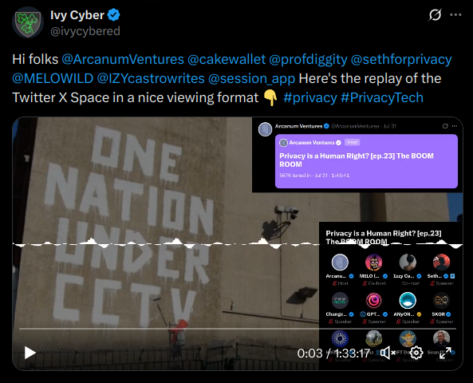

## 📼 Twitter X Spaces Video Project

This documentation covers how to generate a shareable waveform video of a Twitter X Space using a custom graphic, waveform visualization, and recorded audio. It includes creative assets and instructions for modifying or reproducing the process. Example included is the Twitter X Space by @ArcanumVentures on July 31, 2025. https://x.com/ivycybered/status/1951301246427553983



---

### 🎯 Objective

Create `Twitter_Spaces_Overlay_Video.mp4`, a 1280×720 video that:

* Uses a static PNG as the background
* Animates a centered waveform from the audio
* Outputs at 30 FPS and ends when the audio ends

---

### 🧪 FFmpeg Command

```bash
ffmpeg \
-loop 1 -i Twitter_Spaces_Graphic_2025-07-31.png \
-i Arcanum_Stream.m4a \
-filter_complex "\
[1:a]aformat=channel_layouts=mono,showwaves=s=1280x200:mode=line:rate=25:colors=white[waveform]; \
[0:v]scale=1280:720[bg]; \
[bg][waveform]overlay=(W-w)/2:(H-h)/2,format=yuv420p[v]" \
-map "[v]" -map 1:a \
-shortest \
-r 30 \
Twitter_Spaces_Overlay_Video.mp4
```

---

### 🔍 Explanation

* `Twitter_Spaces_Graphic_2025-07-31.png`: Static background image
* `Arcanum_Stream.m4a`: Audio track from Twitter X
* `showwaves`: Generates waveform animation from audio
* `-shortest`: Truncates video when audio ends
* `-r 30`: Outputs at 30 frames per second
* Output: `Twitter_Spaces_Overlay_Video.mp4`

---

### ✂️ Optional: Trim Audio Start/End

Before rendering the final video, you can trim your audio using:

#### ✅ FFmpeg (CLI)

```bash
ffmpeg -ss 00:00:10 -t 00:03:00 -i Arcanum_Stream.flac trimmed.flac
```

* `-ss`: Seek to start point
* `-t`: Duration to record
* Output: `trimmed.flac`

#### ✅ WinFF (GUI for FFmpeg)

For those who prefer a graphical interface, [WinFF](https://github.com/WinFF/winff) offers a friendly way to trim audio/video:

**WinFF Time Tab:**

Use the **"Seek to"** and **"Time to Record"** fields under the **Time** tab:

* `Seek to`: Start position of the trim
* `Time to Record`: Length of the clip you want to keep

---

### 📁 Files

| File                                    | Description                  |
| --------------------------------------- | ---------------------------- |
| `Twitter_Spaces_Graphic_2025-07-31.psd` | Photoshop layered graphic    |
| `Twitter_Spaces_Graphic_2025-07-31.xcf` | GIMP editable version        |
| `Twitter_Spaces_Graphic_2025-07-31.png` | Flattened image for FFmpeg   |
| `Arcanum_Stream.flac`                   | Original lossless recording  |
| `Arcanum_Stream.m4a`                    | Compressed version for video |
| `Twitter_Spaces_Overlay_Video.mp4`      | Final waveform video output  |

---

### 🔊 Audio Recording Process

Audio was captured in [Debian GNU/Linux](https://debian.org) using [GNOME Sound Recorder](https://wiki.gnome.org/Apps/SoundRecorder) with loopback audio:

* **Input Device**:
  `Monitor of Audio Controller Speaker + Headphones`

* **Tools Used**:

  * 🟣 GNOME Sound Recorder (FLAC output)
  * 🧰 Other Options: [Audacity](https://audacityteam.org), [OBS Studio](https://obsproject.com)

---

### 🧱 Graphic Layers

Editable via Photoshop `.psd` or GIMP `.xcf` (Free ***and** Free Software!):

* `Twitter Space Title`: Top text description
* `X Participants`: Visual block for speakers
* `Background`: Poster-style base layer

---

### ✅ Final Output

A branded, media-ready video for:

* Twitter X Space recaps
* Video Shorts or podcast teasers
* Event documentation that doesn't require Twitter X app

---

### 🛡️ License and Attribution

Created by **Sean O'Brien**
📧 [sean@ivycyber.com](mailto:sean@ivycyber.com)
🐦 [@profdiggity](https://twitter.com/profdiggity) for [@IvyCyberEd](https://twitter.com/IvyCyberEd)
🤓 [@profdiggity@privacysafe.social](https://privacysafe.social/@profdiggity) for [@ivycyber@privacysafe.social](https://privacysafe.social/@ivycyber)

#### MIT License

```
MIT License

Copyright (c) 2025 Sean O'Brien

Permission is hereby granted, free of charge, to any person obtaining a copy
of this software and associated documentation files (the “Software”), to deal
in the Software without restriction, including without limitation the rights
to use, copy, modify, merge, publish, distribute, sublicense, and/or sell
copies of the Software, and to permit persons to whom the Software is
furnished to do so, subject to the following conditions:

The above copyright notice and this permission notice shall be included in
all copies or substantial portions of the Software.

THE SOFTWARE IS PROVIDED “AS IS”, WITHOUT WARRANTY OF ANY KIND, EXPRESS OR
IMPLIED, INCLUDING BUT NOT LIMITED TO THE WARRANTIES OF MERCHANTABILITY,
FITNESS FOR A PARTICULAR PURPOSE AND NONINFRINGEMENT. IN NO EVENT SHALL THE
AUTHORS OR COPYRIGHT HOLDERS BE LIABLE FOR ANY CLAIM, DAMAGES OR OTHER
LIABILITY, WHETHER IN AN ACTION OF CONTRACT, TORT OR OTHERWISE, ARISING FROM,
OUT OF OR IN CONNECTION WITH THE SOFTWARE OR THE USE OR OTHER DEALINGS IN
THE SOFTWARE.
```
